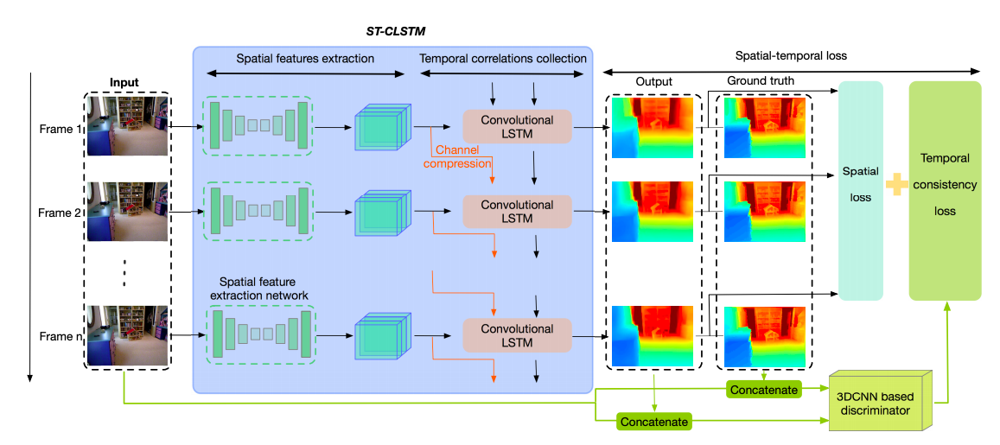

[](https://opensource.org/licenses/MIT)
[](https://www.python.org/)
[](https://pytorch.org/)

# Exploiting Temporal Consistency for Real-Time Video Depth Estimation
This is the UNOFFICIAL implementation of the paper [***Exploiting Temporal Consistency for Real-Time Video Depth Estimation***](https://arxiv.org/abs/1908.03706), ***ICCV 2019, Haokui Zhang, Chunhua Shen, Ying Li, Yuanzhouhan Cao, Yu Liu, Youliang Yan.***

You can find official implementation (WITHOUT TRAINING SCRIPTS) [here](https://github.com/hkzhang91/ST-CLSTM).

## Framework


## Dependencies
- [Python3.6](https://www.python.org/downloads/)
- [PyTorch 1.0+](https://pytorch.org/)
- [NYU Depth v2](https://cs.nyu.edu/~silberman/datasets/nyu_depth_v2.html)

## Pre-processed Data
We didn't preprocess data as in the official implementation. Instead, we use the dataset shared by [Junjie Hu](https://github.com/JunjH/Revisiting_Single_Depth_Estimation), which is also used by [SARPN](https://github.com/Xt-Chen/SARPN/blob/master/README.md).
You can download the pre-processed data from [here](https://drive.google.com/file/d/1WoOZOBpOWfmwe7bknWS5PMUCLBPFKTOw/view?usp=sharing). 

When you have downloaded the dataset, run the following command to creat training list.
```
    python create_list_nyuv2.py

```

You can also follow the procedure of [ST-CLSTM](https://github.com/hkzhang91/ST-CLSTM) to preprocess the data. It is based on the oficial Matlab [Toolbox](https://cs.nyu.edu/~silberman/datasets/nyu_depth_v2.html). If Matlab is unavailable for you, there is also a [Python Port Toolbox](https://github.com/GabrielMajeri/nyuv2-python-toolbox) for processing the raw dataset by [GabrielMajeri](https://github.com/GabrielMajeri), which contains code for Higher-level interface to the labeled subset, Raw dataset extraction and preprocessing and Performing data augmentation.

The final folder structure is shown below.
```
data_root  
|- raw_nyu_v2_250k  
| |- train  
| | |- basement_0001a  
| | | |- rgb  
| | | | |- rgb_00000.jpg  
| | | | |_ ...  
| | | |- depth  
| | | | |- depth_00000.png  
| | | | |_ ...  
| | |_ ...  
| |- test_fps_30_fl5_end  
| | |- 0000  
| | | |- rgb  
| | | | |- rgb_00000.jpg  
| | | | |- rgb_00001.jpg  
| | | | |- ...  
| | | | |- rgb_00004.jpg  
| | | |- depth  
| | | | |- depth_00000.png  
| | | | |- depth_00001.png  
| | | | |- ...  
| | | | |- depth_00004.png  
| | |- ...  
| |- test_fps_30_fl4_end  
| |- test_fps_30_fl3_end>
```
## Train
As an example, use the following command to train on NYUDV2.<br>

```
    CUDA_VISIBLE_DEVICES="0,1,2,3" python train.py --epochs 20 --batch_size 128 \
                            --resume --do_summary --backbone resnet18  --refinenet R_CLSTM_5 \
                            --trainlist_path ./data_list/raw_nyu_v2_250k/raw_nyu_v2_250k_fps30_fl5_op0_end_train.json \
                            --root_path ./data/ --checkpoint_dir ./checkpoint/ --logdir ./log/                           

```
## Evaluation
Use the following command to evaluate the trained model on ST-CLSTM [test data](https://github.com/hkzhang91/ST-CLSTM).<br>

```
    CUDA_VISIBLE_DEVICES="0" python evaluate.py --batch_size 1  --backbone resnet18  --refinenet R_CLSTM_5 --loadckpt ./checkpoint/ \
                            --testlist_path ./data_list/raw_nyu_v2_250k/raw_nyu_v2_250k_fps30_fl5_op0_end_test.json \
                            --root_path ./data/st-clstm/  

```
## Pretrained Model
You can download the pretrained model: [NYUDV2](https://github.com/hkzhang91/ST-CLSTM/tree/master/CLSTM_Depth_Estimation-master/prediction/trained_models)


## Citation

```
@inproceedings{zhang2019temporal,
             title = {Exploiting Temporal Consistency for Real-Time Video Depth Estimation},
             author = {Haokui Zhang and Chunhua Shen and Ying Li and Yuanzhouhan Cao and Yu Liu and Youliang Yan},
             conference={International Conference on Computer Vision},
             year = {2019}   
} 
```